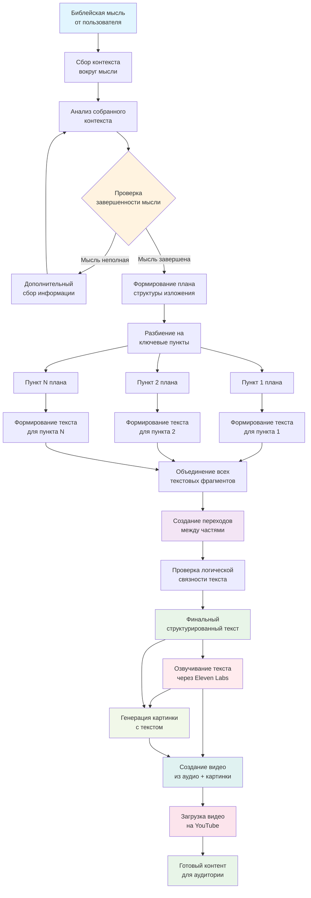

# Bible Podcaster

Автоматический пайплайн создания видео контента для YouTube на основе библейских мыслей.

## Описание проекта

Bible Podcaster — это комплексная система, которая преобразует библейские размышления в готовые видео для YouTube. Проект автоматизирует весь процесс создания контента: от анализа исходной мысли до публикации готового видео.

## Как это работает

### 1. Обработка мысли
- **Ввод**: Библейская мысль или размышление
- **Анализ**: Сбор контекста вокруг мысли
- **Структурирование**: Создание логически связанного плана изложения
- **Генерация**: Формирование структурированного текста с переходами

### 2. Создание медиа-контента
- **Озвучивание**: Преобразование текста в аудио через Eleven Labs
- **Визуализация**: Генерация картинки с текстом
- **Монтаж**: Создание видео из аудио и изображения
- **Публикация**: Автоматическая загрузка на YouTube

## Технологический стек

- **AI Text Processing**: Обработка и структурирование текста
- **Eleven Labs**: Синтез речи
- **Image Generation**: Создание визуального контента
- **Video Processing**: Монтаж видео
- **YouTube API**: Автоматическая публикация

## Особенности

- 🧠 **Интеллектуальная обработка**: Глубокий анализ библейских мыслей
- 🎙️ **Качественное озвучивание**: Использование современных технологий синтеза речи
- 🎨 **Автоматическая визуализация**: Создание привлекательных изображений
- 📹 **Полный цикл производства**: От идеи до готового видео
- 🚀 **Автоматическая публикация**: Прямая загрузка на YouTube

## Цель проекта

Создать эффективный инструмент для распространения библейских размышлений в современном мультимедийном формате, делая духовный контент доступным и привлекательным для широкой аудитории.

## Структура проекта

```
bible-podcaster/
├── text_processor/     # Обработка и структурирование текста
├── audio_generator/    # Генерация аудио через Eleven Labs
├── image_generator/    # Создание изображений
├── video_creator/      # Монтаж видео
├── youtube_uploader/   # Публикация на YouTube
└── pipeline/          # Основной пайплайн обработки
```

## Использование

1. Введите библейскую мысль или размышление
2. Запустите пайплайн обработки
3. Получите готовое видео на YouTube

## Диаграмма


---

*Этот проект создан для служения и распространения библейских истин через современные технологии.* 